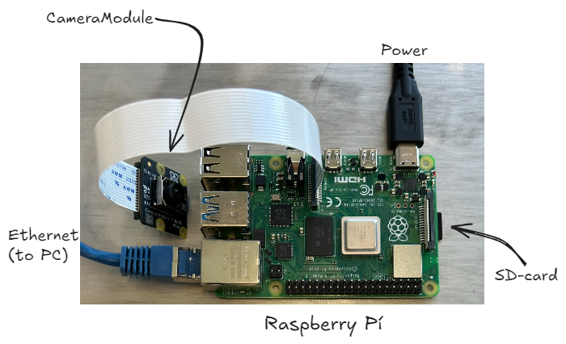

# Camera Module
A lightweight Python module for controlling an external camera server. It lets you seamlessly integrate capturing pictures, recording videos, and streaming of the live camera feeds into your applications.


## Guide
- [Getting Started](#getting-started)
  - [Hardware Needed](#hardware-needed)
  - [Server Setup](#server-setup)
  - [Driver Setup](#driver-setup)
- [`class` CameraDriver](#class-cameradriver)
  - [`method` capture](#method-capture)
  - [`method` start\_video](#method-start_video)
  - [`method` stop\_video](#method-stop_video)
  - [`method` read\_barcode](#method-read_barcode)
  - [`method` read\_qrcode](#method-read_qrcode)
  - [`method` start\_stream](#method-start_stream)
  - [`method` stop\_stream](#method-stop_stream)
- [Example](#example)


## Getting Started
### Hardware Needed  
- RaspberryPi 4 (Model B, 4GB)
- RaspberryPi Camera Module (Version 3, Wide)
- MicroSD Card (Samsung, UHS-I, Class 10, 64GB) 
- Additional Periphery: Power Cable, Ethernet Cable

<span style="color: gray;">
While equivalent modules may work with minor adjustments, this code has been developed and tested specifically for the components listed above. To ensure full compatibility and seamless performance, it is strongly recommended to use the exact hardware.
</span>

### Server Setup
1. Install the `Raspberry Pi OS Lite (64-bit)` operating system on the storage SD - ensure an **internet connection**, **mDNS support** and enable **SSH**. Set HOSTNAME to `camera`, USERNAME to `admin`, and choose your PASSWORD. For more information, follow the step-by-step [installation guide](https://www.raspberrypi.com/documentation/computers/getting-started.html#installing-the-operating-system) on the RaspberryPi website.
   <br><br>
2. Insert the SD card, [install the camera module](https://www.raspberrypi.com/documentation/accessories/camera.html#install-a-raspberry-pi-camera), connect the LAN cable - either directly to PC or via mDNS supporting router - and insert the power cable to start-up the device.
   
   <br>
3. Access the RaspberryPi with
   ```
   ssh admin@camera.local
   ```
   enter `yes` to continue connecting and log in with your password.
   <br><br>
4. **Quick Setup** with the command below: Automatically clones this repo, installs all neccessary dependencies, and creates an @reboot cronjob.
    ```
    curl -sSL https://raw.githubusercontent.com/ChemistryTobias/CameraModule/main/setup.sh | sudo bash
    ```
   A conformation message will appear, if the installation was successfull and the camera can be immediatly used after rebooting.
   <br><br>
> [!TIP]
> SETTING UP CUSTOM IP ADDRESS<br>
> In some applications the camera module can **not** be accessed via WiFi (extract IP adress with command: `ip address show wlan0`) or mDNS (IP adress: `camera.local`). But rather with a wired ethernet connection using specific `ip_adress`, `mask`, `gateway`, and `dns`. One can copy the command below, adapt to their own connection parameter `<...>`, and execute in the terminal.
>    ```
>    sudo nmcli con mod "Wired connection 1" ipv4.addresses <ip_adress>/<mask>
>    sudo nmcli con mod "Wired connection 1" ipv4.gateway <gateway>
>    sudo nmcli con mod "Wired connection 1" ipv4.dns "<dns>"
>    sudo nmcli con mod "Wired connection 1" ipv4.method manual
>    sudo nmcli con up "Wired connection 1"
>    ```


### Driver Setup
All libraries used for this driver are part of the current [Python Standard Library (3.11)](https://docs.python.org/3.11/library/index.html#the-python-standard-library). The `CameraDriver` class can be imported directly from `camera_driver.py`.
```python
from camera_driver.py import CameraDriver
```
<br><br>


## `class` CameraDriver

> This driver establishes a socket connection to the camera server.
> Commands are send over the TCP `CMD_PORT`, which are processed by the _RaspberryPi_ and a response will send back with acknowledgement or an error message.
> The _RaspberryPi_ server sends the data recorded by the camera to the client via the TCP `DATA_PORT` or the UPD `STREAM_PORT`, which can then be processed further.
> Exceptions are the `read_barcode` and `read_qrcode` methods, where the whole processing is done on the sever itself and the resulting message will be tranferred using the `CMD_PORT`.

```python
CameraDriver(IP, CMD_PORT=8000, DATA_PORT=8001, STREAM_PORT=8002)
```

| Parameter     | Description                                                                                               |
| ------------- | --------------------------------------------------------------------------------------------------------- |
| `IP`          | IP address of the camera (_RasperryPi_) server. <br><br>**TYPE:** `str`                                   |
| `CMD_PORT`    | Port for sending and receiving ascii commands and responses. <br><br>**TYPE:** `int` **DEFAULT:** `8000`  |
| `DATA_PORT`   | Port for receiving the camera data (picture, videos). <br><br>**TYPE:** `int` **DEFAULT:** `8001`         |
| `STREAM_PORT` | Port for video streaming via UDP socket. <br><br>**TYPE:** `int` **DEFAULT:** `8002`                       |
<br>

### `method` capture

> Captures image with external camera (server) of specified format, resolution, and focus settings. 
> Receive the raw image data over the data socket and save it to disk at the given path.

```python
capture(file_path='.',
        file_format='jpeg',
        resolution=(4608, 2592)
        autofocus=True,
        focus_length=0.0)
```

| Parameter     | Description                                                                                                                                                                 |
| ------------- | --------------------------------------------------------------------------------------------------------------------------------------------------------------------------- |
| `file_path`   | Relative or absolute file path, where the file will be saved to. Default is the driver working directory. <br><br>**TYPE:** `str` **DEFAULT:** `.`                                  |
| `file_format` | Supported are the following file formats: `jpeg`, `png`, `bmp`, and `gif`. <br><br>**TYPE:** `str` **DEFAULT:** `jpeg`                                                      |
| `resolution`  | Height and width of the RGB array. <br><br>**TYPE:** `tuple` **DEFAULT:** `(4608, 2592)`                                                                                          |
| `autofocus`   | Triggers standard autofocus cycle of [PiCamera2 library](https://datasheets.raspberrypi.com/camera/picamera2-manual.pdf)<br><br>`True` = 'autofocus on', `False` = 'autofocus off' <br><br>**TYPE:** `bool` **DEFAULT:** `True`|
| `focus_length`| Lens position must only set manually, if before `autofocus=False`.<br><br>The minimum value for the lens position is most commonly `0.0` (meaning infinity). For the maximum, a value of `10.0` would indicate that the closest focal distance is 1 / 10 metres, or 10cm. Default values might often be around `0.5` to `1.0`, implying a hyperfocal distance of approximately 1m to 2m. <br><br>**TYPE:** `float` **DEFAULT:** `0.0`|
<br>

### `method` start_video
> Records a raw H.264 video stream from the external camera (server) for a specified duration or until explicitly stopped.
> Saves the incoming .h264 data to disk at the given path.

```python
start_video(file_name,
            file_path=".",
            resolution=(1280, 720),
            duration=5)
```

| Parameter    | Description                                                                                                                                           |
| ------------ | ----------------------------------------------------------------------------------------------------------------------------------------------------- |
| `file_name`  | Base name for the output file ('.h264' extension will be automatically appended).  <br><br>**TYPE:** `str`                                                            |
| `file_path`  | Relative or absolute directory where the `.h264` file will be saved. Default is the driver working directory.  <br><br>**TYPE:** `str` **DEFAULT:** `.` |
| `resolution` | Width and height of the video stream.  <br><br>**TYPE:** `tuple` **DEFAULT:** `(1280, 720)`                                                      |
| `duration`   | Duration in seconds to record. If `None` or `0`, streaming continues until `stop_video()` is called.  <br><br>**TYPE:** `int` **DEFAULT:** `5`            |
<br>

### `method` stop_video
> Sends a `stop_video` command to the camera server to end any active H.264 video stream. The file will be automatically saved to disk.

```python
stop_video()
```

<br>

### `method` read_barcode
> [!WARNING] 
> Not Implemented.

<br>

### `method` read_qrcode
> [!WARNING] 
> Not Implemented.

<br>

### `method` start_stream
> Starts streaming H.264-encoded video from the external camera server to the UDP `STREAM_PORT`.  
> Can be accessed with any H.264 decodable video player (e.g. [VLC](https://en.vlc.de/)) or the [ffplay](https://ffmpeg.org/ffplay.html) library with `ffplay -f mpegts -probesize 32 <udp_stream_link>`.

```python
start_stream(resolution=(1280, 720), 
             IP_out=None)
```

|Parameter|Description|
|---|---|
|`resolution`|Width and height of the streamed video frames.  <br><br>**TYPE:** `tuple` **DEFAULT:** `(1280, 720)`|
|`IP_out`|Destination IP address of the UDP stream for the camera server. If `None`, defaults to the client’s IP.  <br><br>**TYPE:** `str` **DEFAULT:** `None`|
<br>

### `method` stop_stream
> Sends a `stop_stream` command to the camera server to end any active UDP video stream.

```
stop_stream()
```

<br><br>


## Example
```python
from camera_driver.py import CameraDriver
import time

camera = CameraDriver("camera.local")

camera.capture(file_name="photo_test")
camera.start_video(file_name="video_test", duration=5)
```
